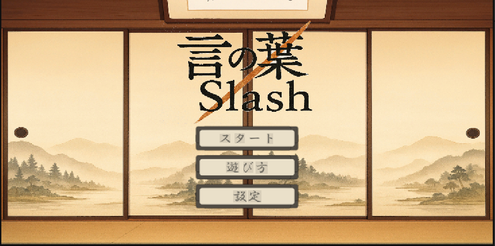
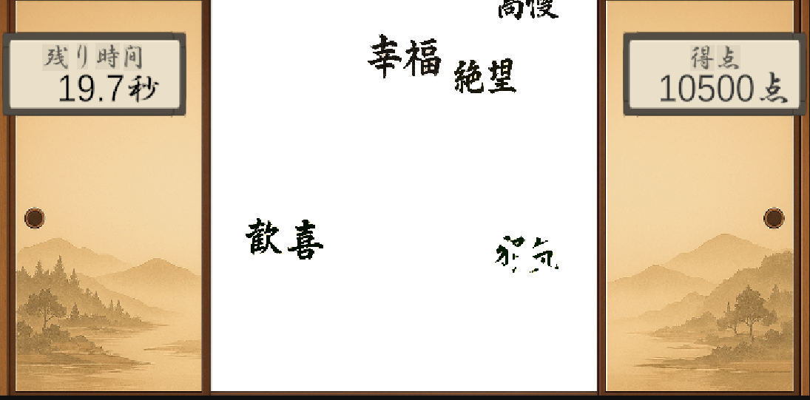
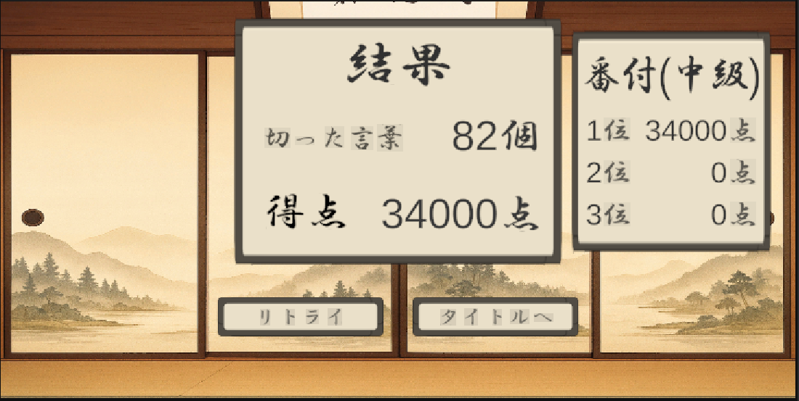

# 言の葉Slash

##  概要
- このプロジェクトは、Unityを用いて制作したブラウザゲームです。
- 難易度を選択し、上から降ってくる言葉を切ってハイスコアを目指しましょう。
- 悪い言葉を切るとポイントを獲得し、良い言葉を切るとポイントが減少します。

## スクリーンショット
- タイトル画面

- プレイ画面

- リザルト画面

##  技術詳細
- **Unity**: ゲームロジック、オブジェクトの配置、ゲーム上のUI
- **C#**: 落下速度や得点の計算やBGMを流すなどのスクリプト作成
- **Git**: ブランチ運用、GithubとGithubDesktopを利用

##  特徴・こだわり
- 拡張性やコメントを意識したスクリプトの作成。
- チーム開発を意識したGithub上での管理。(ブランチ名やコミット、プロジェクトなど)

##  プレイ方法
- [別リポジトリで公開されているサイト](https://kuuorganization0.github.io/KotonohaSlah-web-site/)からプレイ

## 今後の展望、改善点
- ブラウザで公開されることを想定したコードの記述
- 英単語バージョンなどの機能の追加